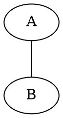
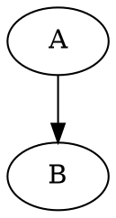

# Introdução ao Graphviz

## O que é o Graphviz?

O **Graphviz** é uma ferramenta que transforma a descrição textual de um grafo em uma representação visual.

Em vez de desenhar cada vértice e cada conexão manualmente, escrevemos o grafo em um arquivo de texto com a extensão `.dot`. O Graphviz lê esse arquivo, organiza os elementos e gera uma imagem.

```text
arquivo .dot -> Graphviz -> imagem do grafo
```

O comando principal usado nesta aula é o `dot`.

## O que é um arquivo `.dot`?

Um arquivo `.dot` descreve a estrutura de um grafo. Ele pode conter:

- o tipo do grafo;
- o nome do grafo;
- os vértices;
- as arestas ou os arcos;
- configurações visuais, como o formato dos vértices;
- comentários para explicar o código.

O arquivo `.dot` não é a imagem. Ele é o código que será interpretado pelo Graphviz.

## Estrutura básica

### Grafo não orientado

Usamos `graph` para declarar um grafo não orientado e `--` para conectar os vértices:



### Grafo orientado

Usamos `digraph` para declarar um grafo orientado e `->` para indicar a direção da conexão:



## Entendendo os elementos

### `graph` e `digraph`

Essas palavras definem o tipo do grafo:

- `graph`: grafo não orientado;
- `digraph`: grafo orientado.

O nome que aparece depois é um identificador para o grafo. Por exemplo, `G1` e `G2` são nomes escolhidos para os exemplos da aula.

```dot
graph G1 {
}
```

As chaves `{ }` delimitam o conteúdo do grafo. Tudo que pertence ao grafo fica dentro delas.

### Vértices

Os vértices são os elementos do grafo. Eles podem ser identificados por números, letras ou palavras:

```dot
1
2
a
b
```

Quando um vértice aparece em uma conexão, o Graphviz pode criá-lo automaticamente. Nos exemplos desta aula, os vértices foram declarados separadamente para configurar sua aparência.

### Arestas e arcos

Em um grafo não orientado, usamos `--`:

```dot
1 -- 2
```

Isso representa uma ligação entre `1` e `2`, sem indicar origem ou destino. A ligação `1 -- 2` equivale a `2 -- 1`.

Em um grafo orientado, usamos `->`:

```dot
a -> b
```

Isso indica que a conexão parte de `a` e chega a `b`. Nesse caso, `a -> b` é diferente de `b -> a`.

### Formato dos vértices

Nos arquivos da aula, cada vértice foi configurado com formato circular:

```dot
1 [shape="circle"]
```

O trecho entre colchetes contém atributos visuais. O atributo `shape="circle"` define que o vértice será desenhado como um círculo.

## Comentários

Comentários ajudam a documentar o código e não são considerados pelo Graphviz ao gerar a imagem.

Comentário de uma linha:

```dot
// Conexões entre os vértices
```

Comentário de várias linhas:

```dot
/*
Descrição do grafo
e das suas conexões.
*/
```

## Exemplos da aula

- [Grafo não orientado](grafo-nao-orientado.dot): usa `graph` e `--`.
- [Grafo orientado](grafo-orientado.dot): usa `digraph` e `->`.

## Formatos de saída

O Graphviz pode gerar imagens e documentos em diferentes formatos. O parâmetro `-T` define o formato de saída:

```powershell
dot -Tpng .\grafo.dot -o .\grafo.png
dot -Tsvg .\grafo.dot -o .\grafo.svg
dot -Tpdf .\grafo.dot -o .\grafo.pdf
```

Nesse comando:

- `dot`: executa o Graphviz;
- `-Tpng`: define PNG como formato de saída;
- `grafo.dot`: arquivo que será lido;
- `-o`: indica o nome do arquivo gerado;
- `grafo.png`: imagem resultante.

Para aprender a executar os arquivos usando nomes preenchíveis, consulte [executar-dot.md](executar-dot.md).

## Próximos passos

- [Configuração do ambiente](configuracao-ambiente.md): instale e configure o Graphviz.
- [Tipos de grafos](tipos-de-grafos.md): aprofunde a diferença entre grafos orientados e não orientados.
- [Executar um arquivo `.dot`](executar-dot.md): transforme o código em uma imagem.
