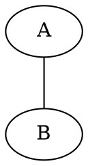
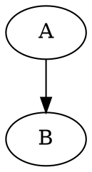

# Tipos de grafos

## Grafo não orientado

Em um grafo não orientado, as conexões não possuem direção. A ligação entre `A` e `B` pode ser percorrida nos dois sentidos.

No Graphviz, usamos `graph` e `--`:

Nesse exemplo, `A -- B` é a mesma conexão que `B -- A`.

Exemplo da aula: [grafo-não-orientado.dot](grafo-nao-orientado.dot)

## Grafo orientado

Em um grafo orientado, cada conexão possui uma direção. Uma ligação de `A` para `B` não significa necessariamente que exista uma ligação de `B` para `A`.

No Graphviz, usamos `digraph` e `->`:

A seta indica que a conexão parte de `A` e chega a `B`.

Exemplo da aula: [grafo-orientado.dot](grafo-orientado.dot)

## Comparação

| Tipo | Graphviz | Conexao | A direcao importa? |
| --- | --- | --- | --- |
| Não orientado | `graph` | `A -- B` | Não |
| Orientado | `digraph` | `A -> B` | Sim |

## Graphviz e teoria dos grafos

Grafo orientado e grafo não orientado são conceitos da Teoria dos Grafos. O Graphviz é uma ferramenta usada para representar esses conceitos visualmente.

- Teoria dos Grafos: estuda vértices, arestas e suas propriedades.
- Arquivo `.dot`: descreve o grafo em texto.
- Graphviz: interpreta o arquivo `.dot` e gera uma imagem do grafo.

## Exemplos e próximos passos

- [Grafo não orientado](grafo-nao-orientado.dot): exemplo com `graph` e `--`.
- [Grafo orientado](grafo-orientado.dot): exemplo com `digraph` e `->`.
- [Introdução ao Graphviz](introducao-graphviz.md): consulte a sintaxe dos arquivos `.dot`.
- [Executar um arquivo `.dot`](executar-dot.md): gere uma imagem dos exemplos.
